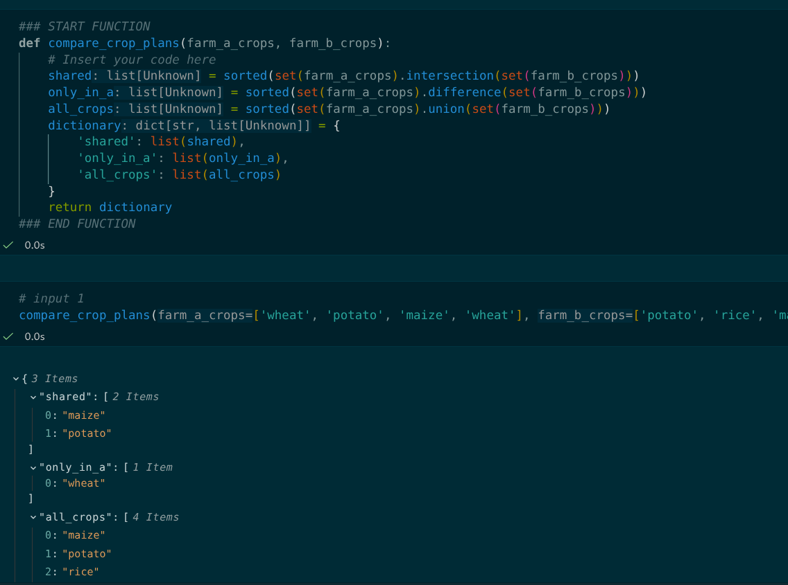
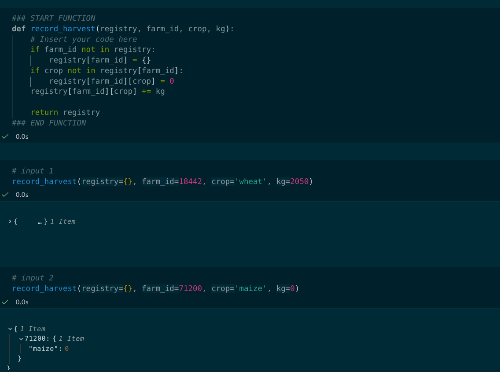
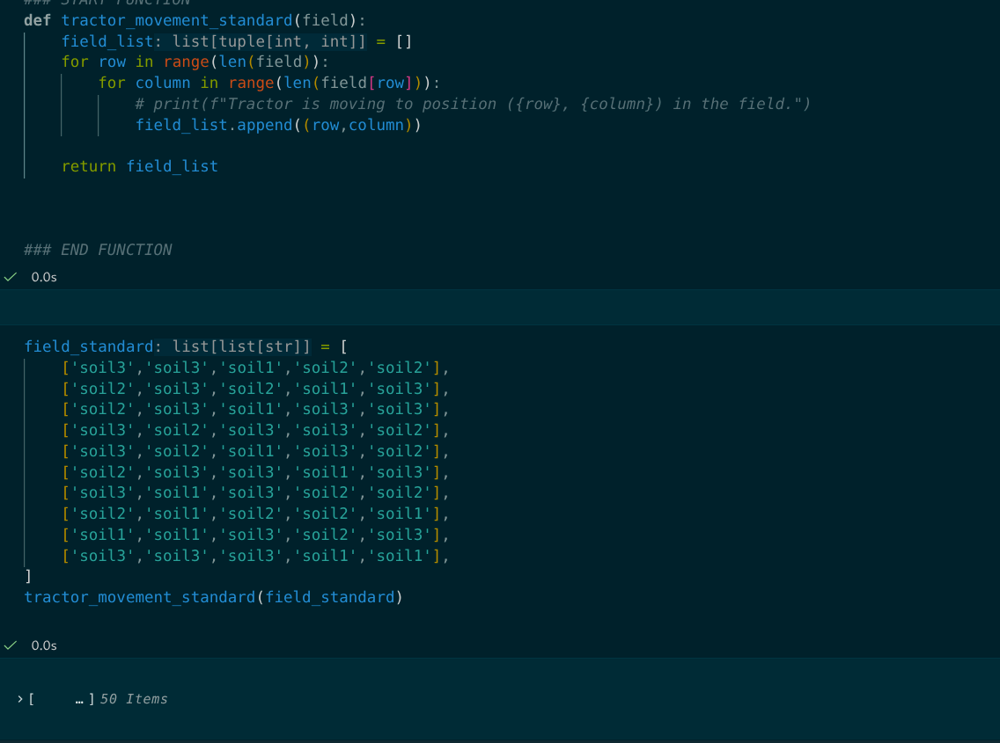
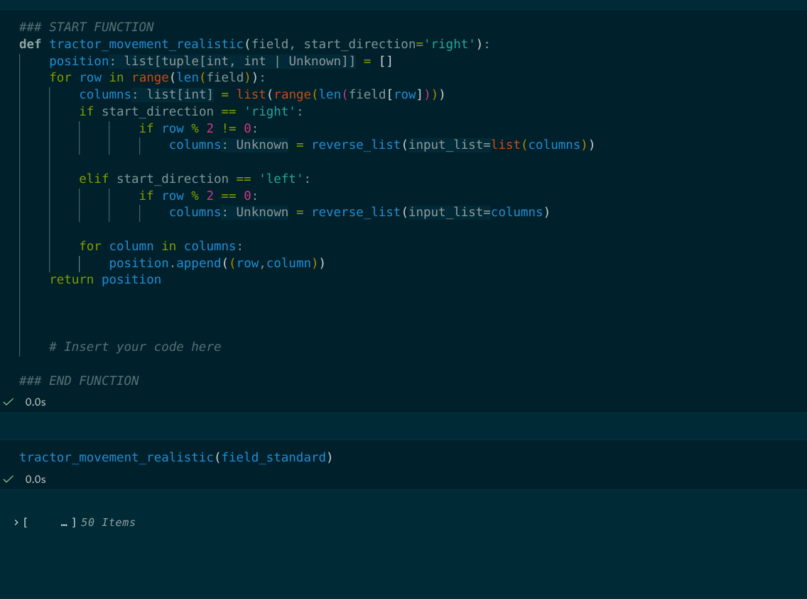

# Agricultural Digital Twin Architecture

**Author:** Victor Njoroge   
**Tech Stack:** Core Python (Zero External Dependencies)

---

## Business Context
The farm is a large enterprise comprising of numerous fields, multiple staff and multiple machinery that need to be accounted for, the data for daily operations ,Analog data logging has created isolated silos, high error rates, and zero real-time querying capabilities.tractors are wasteful of  resources as uncoordinated machinery navigation leads to spatial overlap, inflated fuel usage, and premature equipment wear. the solution write well factored zero dependancy  code to handle the data handling, and machinery oversight via  zero-library python programming 

## Technical Stack & Architectural Constraints

The project relies exclusively on native Python data structures, set operations, and custom control flow with **zero third-party dependencies**. 

By deliberately avoiding abstraction-heavy frameworks like Pandas or NumPy, every spatial algorithm and state mutation explicitly demonstrates raw algorithmic complexity ($O(1)$ set lookups vs. linear scans), explicit boundary defenses, and deterministic memory mutation without external package overhead.

### Core System Bottlenecks
1. **Data Integrity & Visibility:** Daily field operations relied on analog data logging, creating isolated data silos, high human error rates, and zero real-time querying capabilities for operational ledger audits.
2. **Spatial Traversal & Resource Management:** Uncoordinated machinery navigation led to spatial overlap—frequently re-ploughing previously worked ground—inflating fuel consumption and causing premature equipment wear.

### Engineering Mandate
Design and build a zero-dependency Digital Twin in Python to enforce defensive state management, automate cross-farm crop comparisons, and optimize fleet movement via algorithmic path planning.

---

## Architectural Deep Dives & Code Proofs

### 1. Defensive State Management & Ledger Integrity
* **Problem:** Simultaneous harvest entries across different farm locations risked throwing runtime `KeyError` exceptions or overwriting existing yields when keys were uninitialized.
* **Solution (`record_harvest`):** Dynamically inspects nested dictionary paths and initializes missing branches on the fly before aggregating numerical values.

## Poor resource management
* Problem: Standard left-to-right grid sweeps force heavy machinery to loop back across previously plowed rows, driving up fuel consumption and field compaction.

* Solution: A custom Boustrophedon path generation algorithm that alternates direction on adjacent rows, ensuring continuous field coverage with zero spatial overlap.
  <table>
  <tr>
    <td width="50%">
      
      
<b>Standard Traversal</b>

    </td>
    <td width="50%">
      
      
<b>Optimized Boustrophedon Traversal</b>

    </td>
  </tr>
</table>

## key Technical Outcomes: 
1. Operates on standard Python deployments without pip dependencies, ideal for embedded edge systems deployed on remote farm machinery.Spatial 2.Efficiency: Reduced turning overhead and eliminated duplicate spatial coverage, directly lowering operational fuel usage across simulated field 3.trials.Deterministic Execution: Guaranteed $O(1)$ dictionary updates and linear time path generation without runtime dynamic library overhead.
